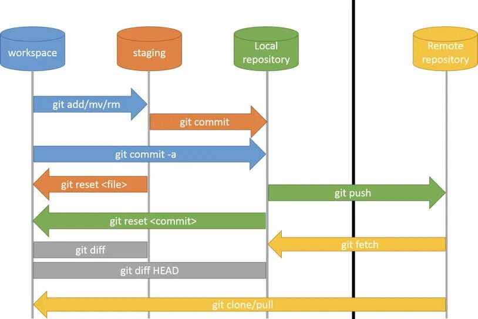

# **Git讲解**

# 一、Git与SVN对比

| 差异   | SVN                                                                                                                                      | Git                                                                                                                                                                                                           |
| ---- | ---------------------------------------------------------------------------------------------------------------------------------------- | ------------------------------------------------------------------------------------------------------------------------------------------------------------------------------------------------------------- |
| 系统特点 | 1. <u>集中式版本控制系统，文档管理很方便。</u><br>2. 企业内部并行集中开发<br>3. `windows`系统上开发推荐使用<br>4. <u>克隆一个拥有将近一万个提交`commit`，五个分支，每个分支有大约`1500`个文件，用时将近一个小时</u> | 1. <u>分布式系统，代码管理很方便。</u><br>2. 开源项目开发。<br>3. `Mac`、`Linux`系统上开发推荐使用。<br>4. 克<u>隆一个拥有将近一万个提交`commit`、五个分支、每个分支有大约`1500`个文件，用时`1`分钟。</u>                                                                        |
| 灵活性  | 1. <u>搭载`SVN`的服务器如果出现故障，就无法与之交互。<br></u>2. <u>所有的`SVN`操作都需要中央仓库交互，例如拉分支，看日志等。</u>                                                        | 1. <u>可以单机操作，`Git`服务器故障也可以在本地`Git`仓库工作。</u><br>2. <u>除了`push`和`pull`或`fetch`操作，其他都可以在本地操作。</u><br>3. <u>根据自己开发任务任意在本地创建分支。</u><br>4. <u>日志都是在本地查看，效率较高。</u>                                                   |
| 安全性  | <u>较差，定期备份，并且是整个`SVN`都得备份。</u>                                                                                                           | <u>较高，每个开发者的本地就是一套完整版本库，记录着版本库的所有信息。</u>                                                                                                                                                                      |
| 分支方面 | 1. 拉分支更像是`copy`一个路径。<br>2. 可针对任何子目录进行`branch`。<br>3. 拉分支的时间较慢，因为拉分支相当于`copy`。<br>4.创建完分支后，影响全部成员，每个人都会拥有这个分支。<br>5.多分支并行开发较重，工作较多而且繁琐。   | 1. 我可以在`Git`的任意一个提交点`commit point`开启分支。<br>2. <u>拉分支时间较快，因为拉分支只是创建文件的指针和`HEAD`。</u><br>3. <u>自己本地创建的分支不会影响其他人。</u><br>4. <u>比较适合多分支并行开发。</u><br>5. `Git checkout hash`切回之前的版本，无需版本回退。<br>6. 强大的`cherry-pick`。 |
| 工作流程 | 1.<u> 每次更改文件之前都得`update`操作，有的时候修改过程中这个文件有更新，`commit`不会成功。</u><br>2. <u>有冲突，会打断提交动作，冲突解决是一个提交速度的竞赛：手快者，先提交，平安无事；手慢者，后提交，可能遇到麻烦的冲突解决。</u>  | 1. <u>开始工作前进行`fetch`+ `merge`操作，完成开发工作后`push`操作，有冲突解决冲突。</u><br>2.<u> `Git`的提交过程不会被打断，有冲突会标记冲突文件。</u><br>3. `Gitflow`经典流程。                                                                                    |
| 内容管理 | `SVN`对中文支持好，操作简单。                                                                                                                        | 对程序的源代码管理方便，代码库占用的空间少，易于分支化管理。                                                                                                                                                                                |
| 学习成本 | 使用起来更方便，`SVN`对中文支持好，操作简单。                                                                                                                | 更在乎效率而不是易用性，成本较高，有很多独有的命令如`rebase`、远程仓库交互的命令等等。                                                                                                                                                               |
| 权限管理 | <u>`SVN`的权限管理相当严格，可以按组、个人针对某个子目录的权限控制，每个目录下都会有个`.SVN`的隐藏文件。</u>                                                                          | <u>`Git`没有严格的权限管理控制，只有账号角色划分。</u>                                                                                                                                                                             |
| 管理平台 | <u>有功能非常完善的插件。</u>                                                                                                                       | <u>除功能插件外，还有`Gitlab`、`Gerrit`、`Github`等。</u>                                                                                                                                                                  |

# 二、Git基本介绍

## 1、Git概述

- git是一个开源的分布式版本控制系统，可以有效、高速地处理从很小到非常大的项目版本管理。
- Git是Linus Torvalds 为了帮助管理 Linux 内核开发而开发的一个开放源码的版本控制软件。
- Git是分布式的,Git不需要有中心服务器

## 2、Git优点

- 速度快
- 简单的设计
- 对非线性开发模式的强力支持（允许成千上万个并行开发的分支）
- 完全分布式
- 有能力高效管理类似 Linux 内核一样的超大规模项目（速度和数据量）


## 3、Git的工作流程

Git一共包含四个区域，本地有三个区域，还有一个远程仓库：

- 工作目录（Working Directory）：平时存放项目代码的地方
- 暂存区（Sstage/index）：临时存放项目改动的地方，保存即提交到文件列表信息
- 本地仓库（Repository/Git Directory）：安全存放数据的位置，包含所有版本的数据
- 远程Git仓库（Remote）：托管代码的服务器


命令概述如下：

- **clone**（克隆）: 从远程仓库中克隆代码到本地仓库
- **checkout** （检出）:从本地仓库中检出一个仓库分支然后进行修订
- **add**（添加）: 在提交前先将代码提交到暂存区
- **commit**（提交）: 提交到本地仓库。本地仓库中保存修改的各个历史版本
- **fetch** (抓取) ： 从远程库，抓取到本地仓库，不进行任何的合并动作，一般操作比较少。
- **pull** (拉取) ： 从远程库拉到本地库，自动进行合并(merge)，然后放到到工作区，相当于 fetch+merge
- **push**（推送） : 修改完成后，需要和团队成员共享代码时，将代码推送到远程仓库

## 4、Git的主要特征



# 二、Git命令

## 1、**新建代码库**

```bash
# 在当前目录新建一个Git代码库
$ git init
# 新建一个目录，将其初始化为Git代码库
$ git init [project-name]
# 下载一个项目和它的整个代码历史
$ git clone [url]
```

### **2、配置**

```bash
# 显示当前的Git配置
$ git config --list
# 编辑Git配置文件
$ git config -e [--global]
# 设置提交代码时的用户信息
$ git config [--global] user.name "[name]"
$ git config [--global] user.email "[email address]"
# 颜色设置
git config --global color.ui true    # git status等命令自动着色
git config --global color.status auto
git config --global color.diff auto
git config --global color.branch auto
git config --global color.interactive auto
git config --global --unset http.proxy   # remove  proxy configuration on git
```

### 3、增加/删除文件

```bash
# 添加指定文件到暂存区
$ git add [file1] [file2] ...
# 添加指定目录到暂存区，包括子目录
$ git add [dir]
# 添加当前目录的所有文件到暂存区
$ git add .
# 添加每个变化前，都会要求确认
# 对于同一个文件的多处变化，可以实现分次提交
$ git add -p
# 删除工作区文件，并且将这次删除放入暂存区
$ git rm [file1] [file2] ...
# 停止追踪指定文件，但该文件会保留在工作区
$ git rm --cached [file]
# 改名文件，并且将这个改名放入暂存区
$ git mv [file-original] [file-renamed]
```

### **4、代码提交**

```bash
# 提交暂存区到仓库区
$ git commit -m [message]
# 提交暂存区的指定文件到仓库区
$ git commit [file1] [file2] ... -m [message]
# 提交工作区自上次commit之后的变化，直接到仓库区
$ git commit -a
# 提交时显示所有diff信息
$ git commit -v
# 将add和commit合为一步
$ git commit -am 'message'
# 使用一次新的commit，替代上一次提交
# 如果代码没有任何新变化，则用来改写上一次commit的提交信息
$ git commit --amend -m [message]
# 重做上一次commit，并包括指定文件的新变化
$ git commit --amend [file1] [file2] ...
```

### **5、分支**

```bash
# 列出所有本地分支
$ git branch
# 列出所有远程分支
$ git branch -r
# 列出所有本地分支和远程分支
$ git branch -a
# 新建一个分支，但依然停留在当前分支
$ git branch [branch-name]
# 新建一个分支，并切换到该分支
$ git checkout -b [branch]
# 新建一个分支，指向指定commit
$ git branch [branch] [commit]
# 新建一个分支，与指定的远程分支建立追踪关系
$ git branch --track [branch] [remote-branch]
# 切换到指定分支，并更新工作区
$ git checkout [branch-name]
# 切换到上一个分支
$ git checkout -
# 建立追踪关系，在现有分支与指定的远程分支之间
$ git branch --set-upstream [branch] [remote-branch]
# 合并指定分支到当前分支
$ git merge [branch]
# 选择一个commit，合并进当前分支
$ git cherry-pick [commit]
# 删除分支
$ git branch -d [branch-name]
# 删除远程分支
$ git push origin --delete [branch-name]
$ git branch -dr [remote/branch]
# 检出版本v2.0
$ git checkout v2.0
# 从远程分支develop创建新本地分支devel并检出
$ git checkout -b devel origin/develop
# 检出head版本的README文件（可用于修改错误回退）
git checkout -- README 
```

### 6、标签

```bash
# 列出所有tag
$ git tag
# 新建一个tag在当前commit
$ git tag [tag]
# 新建一个tag在指定commit
$ git tag [tag] [commit]
# 删除本地tag
$ git tag -d [tag]
# 删除远程tag
$ git push origin :refs/tags/[tagName]
# 查看tag信息
$ git show [tag]
# 提交指定tag
$ git push [remote] [tag]
# 提交所有tag
$ git push [remote] --tags
# 新建一个分支，指向某个tag
$ git checkout -b [branch] [tag]
```

### 7、查看信息

```bash
# 显示有变更的文件
$ git status
# 显示当前分支的版本历史
$ git log
# 显示commit历史，以及每次commit发生变更的文件
$ git log --stat
# 搜索提交历史，根据关键词
$ git log -S [keyword]
# 显示某个commit之后的所有变动，每个commit占据一行
$ git log [tag] HEAD --pretty=format:%s
# 显示某个commit之后的所有变动，其"提交说明"必须符合搜索条件
$ git log [tag] HEAD --grep feature
# 显示某个文件的版本历史，包括文件改名
$ git log --follow [file]
$ git whatchanged [file]
# 显示指定文件相关的每一次diff
$ git log -p [file]
# 显示过去5次提交
$ git log -5 --pretty --oneline
# 显示所有提交过的用户，按提交次数排序
$ git shortlog -sn
# 显示指定文件是什么人在什么时间修改过
$ git blame [file]
# 显示暂存区和工作区的差异
$ git diff
# 显示暂存区和上一个commit的差异
$ git diff --cached [file]
# 显示工作区与当前分支最新commit之间的差异
$ git diff HEAD
# 显示两次提交之间的差异
$ git diff [first-branch]...[second-branch]
# 显示今天你写了多少行代码
$ git diff --shortstat "@{0 day ago}"
# 显示某次提交的元数据和内容变化
$ git show [commit]
# 显示某次提交发生变化的文件
$ git show --name-only [commit]
# 显示某次提交时，某个文件的内容
$ git show [commit]:[filename]
# 显示当前分支的最近几次提交
$ git reflog
```

### **8、远程同步**

```bash
# 下载远程仓库的所有变动
$ git fetch [remote]
# 显示所有远程仓库
$ git remote -v
# 显示某个远程仓库的信息
$ git remote show [remote]
# 增加一个新的远程仓库，并命名
$ git remote add [shortname] [url]
# 取回远程仓库的变化，并与本地分支合并
$ git pull [remote] [branch]
# 上传本地指定分支到远程仓库
$ git push [remote] [branch]
# 强行推送当前分支到远程仓库，即使有冲突
$ git push [remote] --force
# 推送所有分支到远程仓库
$ git push [remote] --all
```

### **9、撤销**

```bash
# 恢复暂存区的指定文件到工作区
$ git checkout [file]
# 恢复某个commit的指定文件到暂存区和工作区
$ git checkout [commit] [file]
# 恢复暂存区的所有文件到工作区
$ git checkout .
# 重置暂存区的指定文件，与上一次commit保持一致，但工作区不变
$ git reset [file]
# 重置暂存区与工作区，与上一次commit保持一致
$ git reset --hard
# 重置当前分支的指针为指定commit，同时重置暂存区，但工作区不变
$ git reset [commit]
# 重置当前分支的HEAD为指定commit，同时重置暂存区和工作区，与指定commit一致
$ git reset --hard [commit]
# 重置当前HEAD为指定commit，但保持暂存区和工作区不变
$ git reset --keep [commit]
# 新建一个commit，用来撤销指定commit
# 后者的所有变化都将被前者抵消，并且应用到当前分支
$ git revert [commit]
# 暂时将未提交的变化移除，稍后再移入
$ git stash
$ git stash pop
```

### 10、其他

```bash
git init                                                  # 初始化本地git仓库（创建新仓库）
git config --global user.name "xxx"                       # 配置用户名
git config --global user.email "xxx@xxx.com"              # 配置邮件
git config --global color.ui true                         # git status等命令自动着色
git config --global color.status auto
git config --global color.diff auto
git config --global color.branch auto
git config --global color.interactive auto
git config --global --unset http.proxy                    # remove  proxy configuration on git
git clone git+ssh://git@192.168.53.168/VT.git             # clone远程仓库
git status                                                # 查看当前版本状态（是否修改）
git add xyz                                               # 添加xyz文件至index
git add .                                                 # 增加当前子目录下所有更改过的文件至index
git commit -m 'xxx'                                       # 提交
git commit --amend -m 'xxx'                               # 合并上一次提交（用于反复修改）
git commit -am 'xxx'                                      # 将add和commit合为一步
git rm xxx                                                # 删除index中的文件
git rm -r *                                               # 递归删除
git log                                                   # 显示提交日志
git log -1                                                # 显示1行日志 -n为n行
git log -5
git log --stat                                            # 显示提交日志及相关变动文件
git log -p -m
git show dfb02e6e4f2f7b573337763e5c0013802e392818         # 显示某个提交的详细内容
git show dfb02                                            # 可只用commitid的前几位
git show HEAD                                             # 显示HEAD提交日志
git show HEAD^                                            # 显示HEAD的父（上一个版本）的提交日志 ^^为上两个版本 ^5为上5个版本
git tag                                                   # 显示已存在的tag
git tag -a v2.0 -m 'xxx'                                  # 增加v2.0的tag
git show v2.0                                             # 显示v2.0的日志及详细内容
git log v2.0                                              # 显示v2.0的日志
git diff                                                  # 显示所有未添加至index的变更
git diff --cached                                         # 显示所有已添加index但还未commit的变更
git diff HEAD^                                            # 比较与上一个版本的差异
git diff HEAD -- ./lib                                    # 比较与HEAD版本lib目录的差异
git diff origin/master..master                            # 比较远程分支master上有本地分支master上没有的
git diff origin/master..master --stat                     # 只显示差异的文件，不显示具体内容
git remote add origin git+ssh://git@192.168.53.168/VT.git # 增加远程定义（用于push/pull/fetch）
git branch                                                # 显示本地分支
git branch --contains 50089                               # 显示包含提交50089的分支
git branch -a                                             # 显示所有分支
git branch -r                                             # 显示所有原创分支
git branch --merged                                       # 显示所有已合并到当前分支的分支
git branch --no-merged                                    # 显示所有未合并到当前分支的分支
git branch -m master master_copy                          # 本地分支改名
git checkout -b master_copy                               # 从当前分支创建新分支master_copy并检出
git checkout -b master master_copy                        # 上面的完整版
git checkout features/performance                         # 检出已存在的features/performance分支
git checkout --track hotfixes/BJVEP933                    # 检出远程分支hotfixes/BJVEP933并创建本地跟踪分支
git checkout v2.0                                         # 检出版本v2.0
git checkout -b devel origin/develop                      # 从远程分支develop创建新本地分支devel并检出
git checkout -- README                                    # 检出head版本的README文件（可用于修改错误回退）
git merge origin/master                                   # 合并远程master分支至当前分支
git cherry-pick ff44785404a8e                             # 合并提交ff44785404a8e的修改
git push origin master                                    # 将当前分支push到远程master分支
git push origin :hotfixes/BJVEP933                        # 删除远程仓库的hotfixes/BJVEP933分支
git push --tags                                           # 把所有tag推送到远程仓库
git fetch                                                 # 获取所有远程分支（不更新本地分支，另需merge）
git fetch --prune                                         # 获取所有原创分支并清除服务器上已删掉的分支
git pull origin master                                    # 获取远程分支master并merge到当前分支
git mv README README2                                     # 重命名文件README为README2
git reset --hard HEAD                                     # 将当前版本重置为HEAD（通常用于merge失败回退）
git rebase
git branch -d hotfixes/BJVEP933                           # 删除分支hotfixes/BJVEP933（本分支修改已合并到其他分支）
git branch -D hotfixes/BJVEP933                           # 强制删除分支hotfixes/BJVEP933
git ls-files                                              # 列出git index包含的文件
git show-branch                                           # 图示当前分支历史
git show-branch --all                                     # 图示所有分支历史
git whatchanged                                           # 显示提交历史对应的文件修改
git revert dfb02e6e4f2f7b573337763e5c0013802e392818       # 撤销提交dfb02e6e4f2f7b573337763e5c0013802e392818
git ls-tree HEAD                                          # 内部命令：显示某个git对象
git rev-parse v2.0                                        # 内部命令：显示某个ref对于的SHA1 HASH
git reflog                                                # 显示所有提交，包括孤立节点
git show HEAD@{5}
git show master@{yesterday}                               # 显示master分支昨天的状态
git log --pretty=format:'%h %s' --graph                   # 图示提交日志
git show HEAD~3
git show -s --pretty=raw 2be7fcb476
git stash                                                 # 暂存当前修改，将所有至为HEAD状态
git stash list                                            # 查看所有暂存
git stash show -p stash@{0}                               # 参考第一次暂存
git stash apply stash@{0}                                 # 应用第一次暂存
git grep "delete from"                                    # 文件中搜索文本“delete from”
git grep -e '#define' --and -e SORT_DIRENT
git gc
git fsck
# 生成一个可供发布的压缩包
$ git archive
```