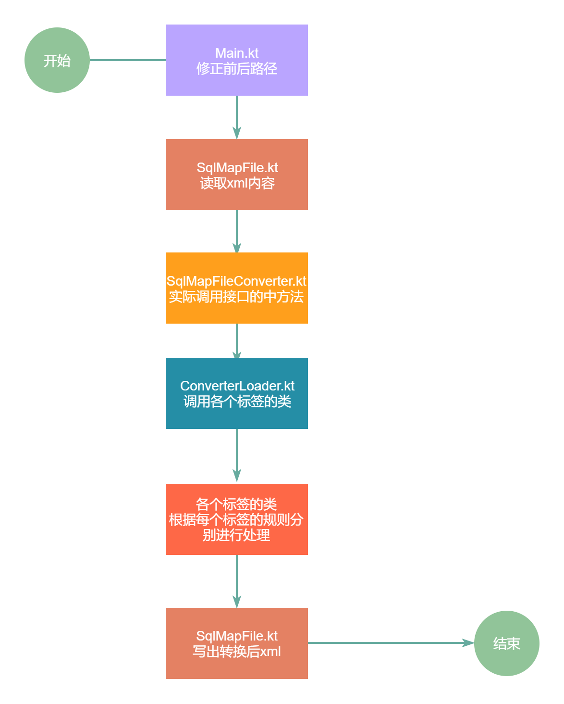

# iBatis到MyBatis（sqlMap.xml部分）迁移技术方案

关键字：iBatis、MyBatis、w3c.dom、kotlin

摘要：本方案采用了tool化的方式，将项目中所有IBatis的sqlMap.xml全部转换为MyBatis的sqlMap.xml，从而帮助项目组大大提高了项目整体的移行效率，有效的降低了bug数，提高项目整体的生产性。

## 1引言

#### 1.1.概述：

该方案的目的就是为了在项目移行时，减少人力，降低项目成本，通过Tool化的方式，降低Bug率，降低手修正率。

应用领域是本方案可以针对iBatis2到MyBatis3中所有sqlMap.xml进行转换

#### 1.2.问题：

该方案可以有效的将ibatis的sqlMap.xml转换成MyBatis的sqlMap.xml

#### 1.3.背景：

本项目是框架移行项目，从原有的Struts框架转换成Spring框架，项目整体方针全部采用Tool化，对不能Tool化的部分，进行手修正，个人承担项目中所有xml的转换，本方案只是其中的一个部分，在此进行详细说明。

## 2.解决方案

#### 2.1.策略

w3c.dom解析xml文件

#### 2.2.结构

##### 2.2.1.整体流程

##### 2.1.2.结构分层

首先，该方案以标签（tag）为单位，把每个作为转换对象的标签（tag）都做成了一个class类，然后去实现共通的接口，接口中方法都是共通的，所以，在实现的时候只要传递不同的参数即可完成转换。

#### 2.3.技术特点

该技术方案中，采用kotlin语言进行编程，运用了w3c.dom组件，对sqlMap.xml进行了解析，对xml内部的标签，属性，属性值等，进行了读取，并按照事先整理好的规则进行一系列的修改，最后将按照规则修改后的xml进行写出操作，从而实现对sqlMap.xml的转换。

## 3.环境及约束

#### 3.1.运行环境要求

操作系统：windows10 64位 8g以上内存

JDK版本：1.8以上（>=1.8）

运行软件：idea/装了kotlin插件的eclipse

maven版本：apache-maven-3.8.1

#### 3.2.其他要求

无

## 4.解决效果

#### 4.1.效果

#### 4.2.示例代码

## 5.参考资料

